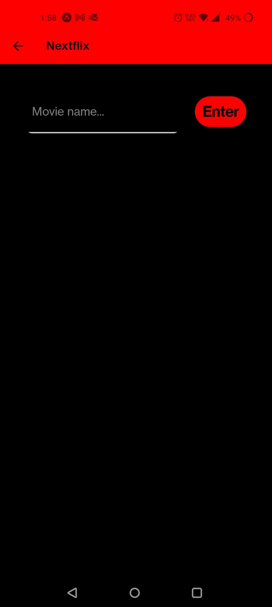
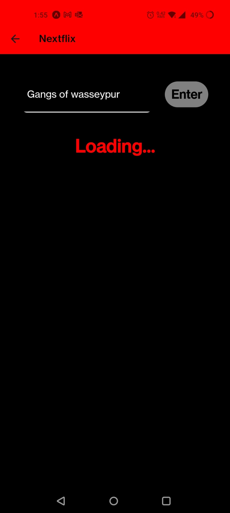
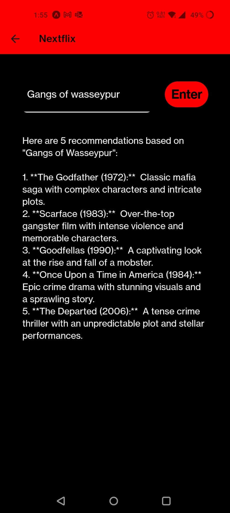

# Nextflix

Nextflix is a movie recommendation app built using React Native and Google Gemini API. By taking a single movie name as input, it suggests five movies that you might enjoy based on your preference. This project aims to enhance your movie-watching experience by providing personalized recommendations.

## Key Features

- **Personalized Recommendations:** Enter the name of a movie, and get five movie suggestions tailored to your taste.
- **User-Friendly Interface:** Simple and intuitive interface designed for seamless user experience.
- **Cross-Platform:** Built with React Native, ensuring compatibility with both Android and iOS devices.
- **Real-Time Suggestions:** Utilizes Google Gemini API for quick and accurate movie recommendations.

## Short Description

Nextflix leverages the power of Google Gemini API to deliver customized movie recommendations. By simply typing in the name of a movie you like, the app generates a list of five movies that match your taste. This user-friendly app is built with React Native, making it accessible on multiple platforms and providing a smooth and interactive experience.

## Snippets

    
    

    
    

## Tech Used

- **React Native:** For building the cross-platform mobile application.
- **Google Gemini API:** For fetching movie recommendations based on the input movie name.
- **JavaScript:** Core language used in the development of the app.
- **CSS:** For styling the app and enhancing its visual appeal.

## How to use
1. Clone the repository: `git clone https://github.com/sarthakmishraa/Nextflix.git`